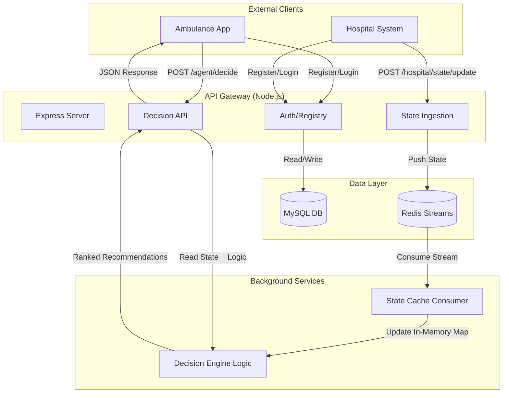

# Distributed Hospital Coordination Mesh (DHCM)

A Node.js backend system for real-time coordination between ambulances and hospitals. Designed for high-frequency updates, resilience, and deterministic decision-making.

## 🏗️ Architecture

The system uses a **Hybrid Architecture**:
1.  **MySQL**: Persistent Registry (Hospitals, Ambulances, Cases).
2.  **Redis Streams**: High-throughput Event Bus for live telemetry (Bed availability, Location).
3.  **State Cache**: In-memory consumers that maintain the latest "World State".
4.  **Decision Engine**: Pure functional logic to rank hospitals based on live state + constraints.



---

## 🚀 Key Features

### 1. Real-Time Telemetry
Hospitals push updates via `POST /hospital/state/update`. The backend validates identity in MySQL and pushes to a Redis Stream (`hospital:state`).

### 2. Zero-Latency Decision Engine
Instead of querying the DB for every request, the **Decision Agent** maintains a live in-memory replica of the hospital network state.
-   **Input**: Ambulance location, Patient severity, Filter constraints.
-   **Logic**:
    -   Filters by distance (Haversine).
    -   Scores based on Availability (ICU/Beds), Load, and Distance.
    -   Matches Specialties.
-   **Output**: Judge-grade ranked list with **Explanations** (e.g., "ICU Available", "Close <5km").

### 3. Persistent Registry
Core identities (`hospitals`, `ambulances`) are stored in MySQL for reliability and long-term data integrity.

---

## 🛠️ API Reference

### 🏥 Hospital Registry
-   `POST /hospitals/register`: Create authoritative hospital identity.
-   `POST /hospitals/login`: Authenticate hospital.

### 🚑 Ambulance Registry
-   `POST /ambulances/register`: Register fleet vehicle.
-   `POST /ambulances/login`: Authenticate vehicle.

### 📡 Live State
-   **`POST /hospital/state/update`**
    -   Payload: `{ hospital_id, available_beds, status, ... }`
    -   Action: Pushes to Redis Stream.

### 🧠 Decision Engine
-   **`POST /agent/decide`**
    -   Payload:
        ```json
        {
          "request_id": "uuid",
          "ambulance": { "latitude": 17.385, "longitude": 78.486 },
          "patient": { "severity_level": 4, "requires_icu": true }
        }
        ```
    -   Response:
        ```json
        {
          "recommendations": [
            {
              "hospital_id": "...",
              "score": 85.0,
              "reasons": ["ICU Available", "Very Close"],
              "snapshot": { ... }
            }
          ]
        }
        ```

---

## ⚡ Quick Start

### 1. Prerequisites
-   Docker & Docker Compose
-   Node.js v16+

### 2. Start Infrastructure
```bash
docker-compose up -d
```
This starts **MySQL** (Port 3306) and **Redis** (Port 6379).

### 3. Install Dependencies
```bash
npm install
```

### 4. Initialize Database
```bash
node scripts/init_db.js
```
*Note: If you encounter column errors, run `node scripts/migrate_schema_fix.js`.*

### 5. Run Server
```bash
npm run dev
```
Server runs on `http://localhost:3000`.

### 6. Simulation
To simulate hospital traffic:
```bash
npm run producer
```
To view decision agent logs (optional):
```bash
npm run agent
```
